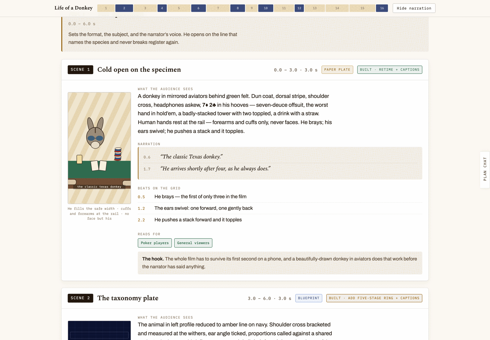
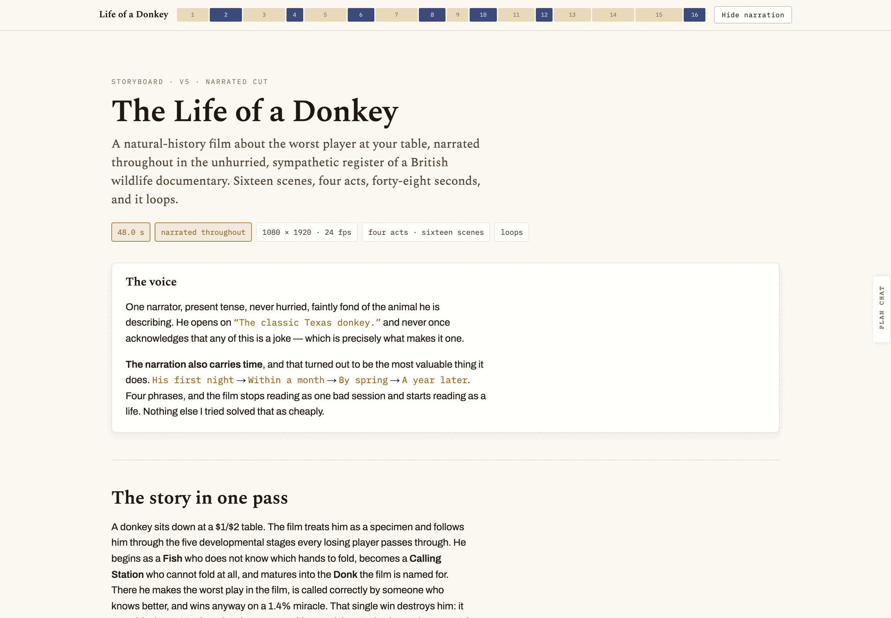
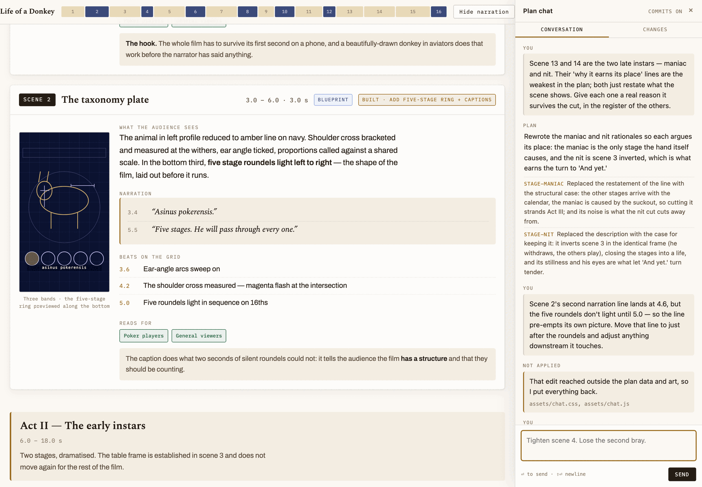
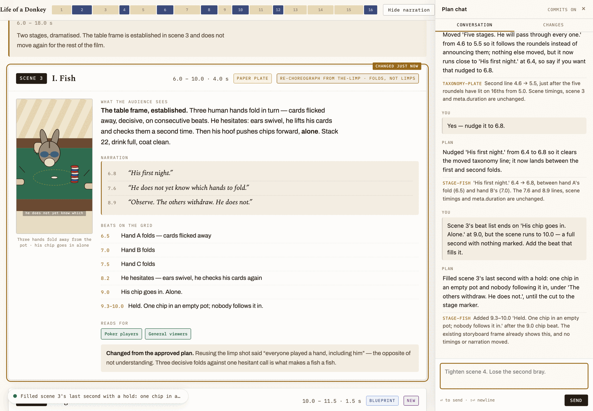

<div align="center">

# Film Plan

**A film is a thing that happens over time, and a document cannot show you
time. So plan it as a page — every scene drawn, every line of narration against
the second it lands — and when you want it changed, say so to the page.**

```bash
npx skills add seyonv/film-plan
```

</div>

---



## The problem

Ask any coding agent to plan a film and you get a markdown shot list:

> **Scene 4 — The Donk Bet (18.0–21.5s)**
> The donkey leads out into three checked streets. Narration: "And here, the
> behaviour that gives the animal its name." Beat on 19.2: chips forward.
> Rationale: establishes the titular move.

Multiply by sixteen. Now answer these: does it add up to forty-eight seconds?
Is act III longer than act I? Does the narration sound like one person wrote
it? Which scene is still a stub?

You cannot answer any of them by reading, because the document has thrown away
the two things a film is made of — **duration and simultaneity**. Everything
that matters is spread across sixteen headings you have to hold in your head
at once.

| What a document loses | Why it matters |
| --- | --- |
| **Shape** | Sixteen equal headings. An act that is twice as long looks exactly the same on the page. |
| **The frame** | "The donkey leads out" is not a composition. You cannot tell if he is even in shot. |
| **The clock** | Timecodes are text. Nothing catches it when scene 4 grows and scene 5 never moves. |
| **Honesty** | Every scene reads as finished. Nothing marks the five that are stubs. |

## What it builds instead

One page, self-contained, that you scroll once.

**The scrubber** across the top is the whole film. One cell per scene, **width
proportional to its duration**, coloured by visual register. A bloated act is
visible before you have read a word.


**The masthead** carries the hard facts — runtime, format, frame rate — and the
one paragraph that says what the film is.



**Every scene card** puts a drawn frame beside what the audience sees, the
narration against its timecode, the beats on the grid, and — the field that
does the most work — **why the scene earns its place.** If you cannot finish
that sentence, the scene is decoration, and the plan says so out loud.

The storyboard frames are **drawn in code**, as SVG on the real film frame. A
shared `figure()` helper used in nine scenes is what makes nine frames look
like one film, and a re-time becomes an edit to one number.

Below the scenes, the narration script and a status table are **derived from
the same data**. Nothing in the page is written twice.

## Then you talk to it



A rail docks on the right, collapsed to a slim tab until you want it. You type
the note you would have given a collaborator:

> *Scene 2's second narration line lands at 4.6, but the five roundels don't
> light until 5.0 — so the line pre-empts its own picture. Move it to just
> after the roundels.*

A headless Claude Code worker picks it up, edits the plan, and the page updates
itself in place. It answers like someone who has read the whole thing:

> Moved 'Five stages. He will pass through every one.' from 4.6 to 5.5 so it
> follows the roundels instead of announcing them; nothing else moved, but it
> now runs close to 'His first night.' at 6.4, so say if you want that nudged
> to 6.8.

It is **one continuing conversation**, not a series of one-shots. "Yes — nudge
it to 6.8." works, and lands the line between the two folds it has to clear.



The changed scene is **ringed and marked where it happened**, so you see the
edit rather than go hunting for it. While the worker is thinking, a small pill
in the corner tells you what it is doing — nothing modal, nothing blocking, you
keep reading. When it lands you get a browser notification and a title badge,
because by then you are in another tab.

Every accepted change is **its own git commit** with a one-click undo.

## What the worker cannot touch

This is the part that makes it safe to leave running.

The plan is three files. The worker may edit **two** of them:

| File | Holds | Worker |
| --- | --- | --- |
| `plan.data.js` | `window.PLAN` — the words and the numbers | ✅ |
| `plan.art.js` | `window.PLAN_ART` — the drawn frames | ✅ |
| `plan.html` | tokens, CSS, the renderer | ❌ refused |

Four things enforce it, in order:

1. **`--restricted`** — the worker has no shell. No Bash, no scripts.
2. **A `PreToolUse` hook** refuses any write outside those two files.
3. **A backstop** catches anything the hook missed, attributed from the
   worker's own tool stream — so editing the repo in another window while a
   turn runs does not poison the turn.
4. **A validation gate** loads both files in a sandbox and checks that every
   scene has a timecode that parses, that scenes run back to back, and that
   every scene id still resolves to a drawing returning balanced `<svg>`.

A turn that fails any of these is rolled back before it reaches the page, and
comes back as a sentence in the chat:

> *That change broke the plan, so I reverted it: scene 4 art is malformed:
> unclosed tag `<g>`.*

You never see a broken page. The worst case is a turn that did nothing and told
you why.

## Install

```bash
npx skills add seyonv/film-plan
```

Then, in any repo:

> plan a film about the last Blockbuster

## Try it in ten seconds

The repo ships the plan for a real 48-second film — sixteen scenes, four acts,
a narrator doing David Attenborough over a poker table.

```bash
git clone https://github.com/seyonv/film-plan
cd film-plan/examples/life-of-a-donkey
./plan.sh
```

That opens the page with the chat rail live, including the **actual transcript
of the conversation in the screenshots above**. Ask it for something.

This copy is a snapshot for demonstration and is deliberately not kept in sync
with the film it came from.

## Using it

**A new film.** Say what you want planned. The skill interviews you — length,
aspect, audience, register, whether it loops — then finds the spine, designs an
aesthetic *for that film*, and builds the page. It does not reuse the last look;
a nature documentary and a title sequence should not produce the same page.

**An existing plan.** Point it at your scenes. It will want the spine first.

**Serving it.** `docs/plan.sh` — serves the plan with the rail attached, on a
free port, and opens your browser. Opened straight off disk the plan still
reads perfectly; it just cannot be talked to.

**Sending it to someone.** `node tools/inline.mjs --dir docs` fuses the three
files back into one self-contained HTML that opens anywhere, with no server and
no chat.

## How it works

```
page ──POST /__plan/chat──▶ server ──claude -p──▶ worker
                              │                     │ edits plan.data.js
                              │                     │ edits plan.art.js
                              │                     │ writes turn report
                              │◀────────────────────┘
                              │ validate → commit → SSE
page ◀──────events───────────┘  re-render, mark what changed, notify
```

`plan.server.mjs` is **zero dependency** — Node's own http, vm and
child_process, nothing installed. It serves the plan, queues one turn at a
time, spawns the worker with a persistent resumable session, streams its tool
calls to the page as the live status line, validates, commits and broadcasts.

The page re-renders in place by calling `window.renderPlan()` again, so an edit
never costs you your scroll position.

Full internals: [`references/chat-bridge.md`](references/chat-bridge.md).
The data contract: [`references/anatomy.md`](references/anatomy.md).
Drawing frames: [`references/art-direction.md`](references/art-direction.md).

## Tests

```bash
node assets/plan.server.mjs --selftest        # stub worker, free, ~4s
node assets/plan.server.mjs --selftest=live   # real worker, real tokens
```

Both build a throwaway plan in a real git repo and drive the real server over
real HTTP: serving, the guard hook, a good turn, a turn that breaks the art, a
turn that reaches outside its remit, a concurrent edit elsewhere in the repo,
commits, undo, and the event stream. 27 assertions, and the live run is the
same 27 against an actual `claude -p`.

## Requirements

- **Node 20+** — uses `node:vm` for the validation sandbox and native `fetch`
- **[Claude Code](https://claude.com/claude-code)** on your `PATH` for the chat
- **git**, optional — without it the chat still works, undo falls back to
  snapshots of the most recent turn

## License

MIT — see [LICENSE](LICENSE).
